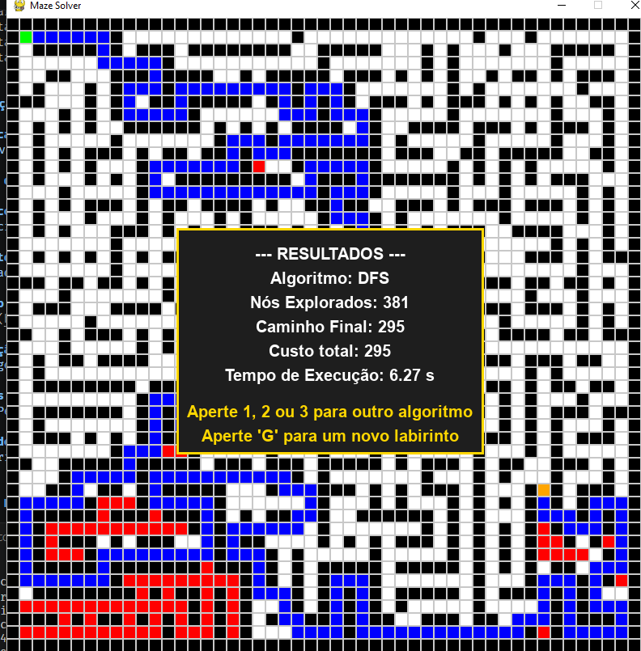
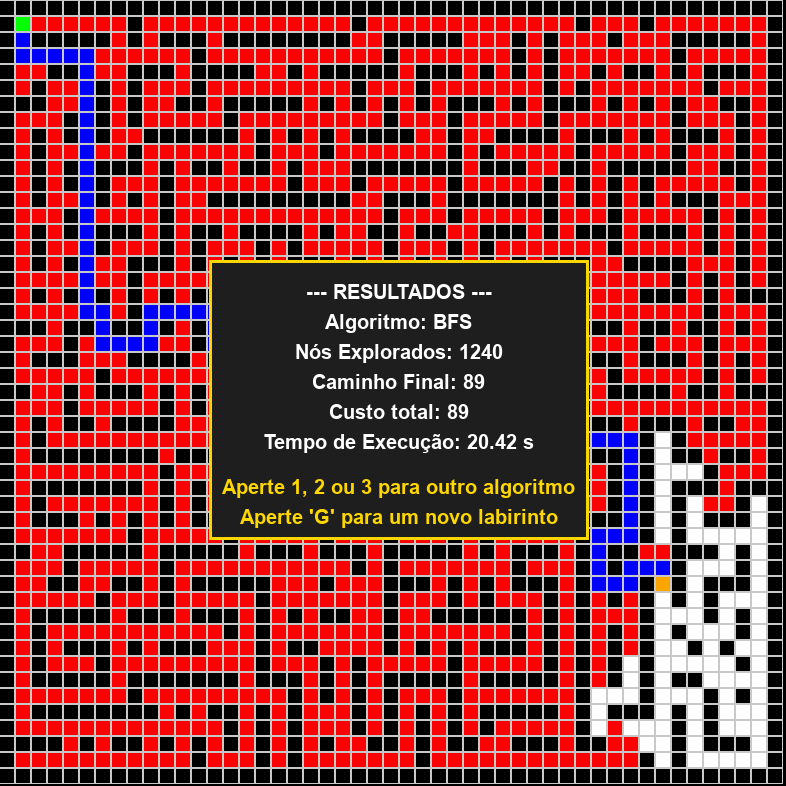
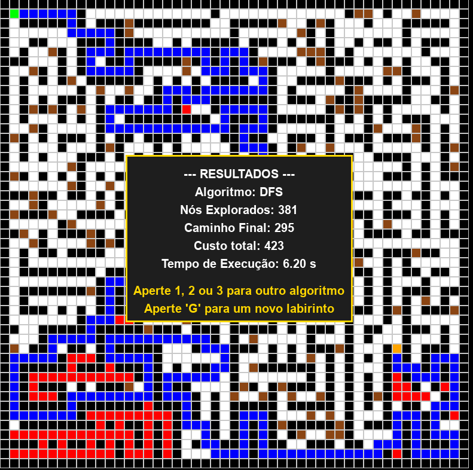
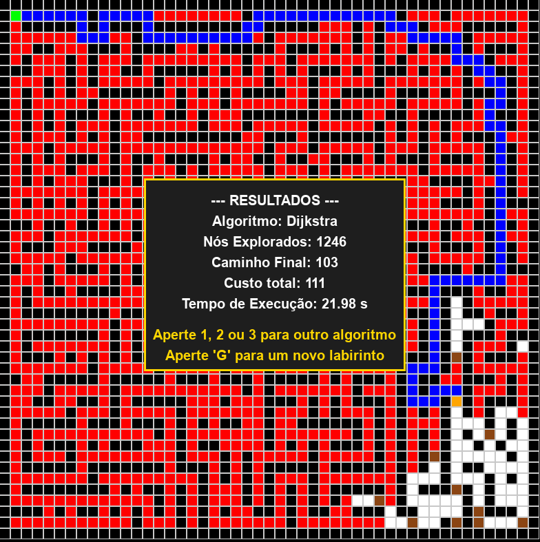

# Maze Solver - Visualizador de Algoritmos de Busca em Grafos

> Ferramenta interativa para visualizar e comparar algoritmos de busca em labirintos gerados proceduralmente.

**Disciplina:** Projeto de Algoritmos (Turma G43)  
**Período:** 2026.1  
**Módulo:** 1 - Grafos  
**Alunos:** Renato Gameiro e Vinicius Araruna

---

## Descrição do Projeto

Este projeto implementa uma aplicação educativa que permite a visualização de algoritmos de busca em grafos através de um labirinto dinâmico. O usuário pode gerar labirintos aleatórios, adicionar terrenos com custos variáveis ("pântanos") e comparar o desempenho de três algoritmos clássicos:

- **DFS (Depth-First Search)** - Busca em Profundidade
- **BFS (Breadth-First Search)** - Busca em Largura  
- **Dijkstra** - Algoritmo de Caminho Mínimo

A aplicação fornece análise em tempo real mostrando:
- Nós explorados durante a busca
- Tamanho do caminho final encontrado
- Custo total da trajetória
- Tempo de execução

---

## Funcionalidades

✅ **Geração Procedural de Labirintos**
- Implementação do algoritmo Recursive Backtracker (DFS)
- Gera labirintos perfeitos (sem loops)

✅ **Visualização Animada**
- Células exploradas em vermelho
- Caminho final em azul
- Pântanos em marrom

✅ **Terrenos com Pesos**
- Espalhar "lama/pântanos" por todo o mapa
- Dijkstra evita terrenos pesados (custo 5x)
- BFS/DFS não otimizam para pesos

✅ **Métricas de Desempenho**
- Contador de nós explorados
- Tempo de execução em milissegundos
- Custo total do caminho
- Painel visual com resultados

✅ **Interação em Tempo Real**
- Clique para criar paredes manualmente
- Defina pontos de início e fim
- Execute algoritmos com uma tecla

---

## Requisitos

- **Python:** 3.8 ou superior
- **Pygame:** 2.6.1
- **Sistema Operacional:** Windows, macOS ou Linux

---

## Instalação

### 1. Clonar Repositório
```bash
git clone https://github.com/seu-usuario/G43_Grafos_PA-26.1.git
cd G43_Grafos_PA-26.1
```

### 2. Criar Ambiente Virtual
```bash
# Windows
python -m venv venv
.\venv\Scripts\Activate

# macOS/Linux
python3 -m venv venv
source venv/bin/activate
```

### 3. Instalar Dependências
```bash
pip install -r requirements.txt
```

### 4. Executar
```bash
python src/main.py
```

Será solicitado o tamanho do grid (entre 5 e 50):
```
Tamanho do grid (entre 5 e 50)
  Linhas  [49]: 49
  Colunas [49]: 49
```

---

##  Controles

| Tecla | Ação |
|-------|------|
| **Mouse Esquerdo** | Adicionar/remover parede |
| **Mouse Direito** | Define ponto de início (verde) |
| **Mouse Meio** | Define ponto de fim (laranja) |
| **G** | Gerar novo labirinto |
| **L** | Espalhar lama/pântanos (10% do mapa) |
| **R** | Resetar grid e limpar células |
| **1** | Executar DFS |
| **2** | Executar BFS |
| **3** | Executar Dijkstra |

---
## 🎥 Demonstração

### Vídeo Explicativo
[🔗 Assista ao vídeo completo explicando o projeto e algoritmos](https://www.youtube.com/watch?v=trGtt7kMrqE)

### Screenshots do Funcionamento

#### 3. Execução do DFS

#### 3. Execução do BFS


#### 4. Comparação de Algoritmos





---
## Estrutura do Projeto

```
G43_Grafos_PA-26.1/
├── README.md                    # Este arquivo
├── requirements.txt             # Dependências
├── src/
│   ├── main.py                 # Arquivo principal (loop do Pygame)
│   ├── settings.py             # Configurações (cores, tamanhos, FPS)
│   ├── core/
│   │   ├── cell.py             # Classe Cell (célula do grid)
│   │   └── grid.py             # Classe Grid (matriz de células)
│   └── algorithms/
│       ├── maze_generator.py   # Geração de labirinto (DFS)
│       ├── dfs.py              # Busca em Profundidade
│       ├── bfs.py              # Busca em Largura
│       └── dijkstra.py         # Algoritmo de Dijkstra
└── venv/                        # Ambiente virtual (ignorado)
```

---

## Detalhes dos Algoritmos

### DFS (Depth-First Search)
- **Complexidade:** O(V + E) onde V = vértices, E = arestas
- **Espaço:** O(V) para a pilha
- **Características:** Explora o máximo possível em cada direção antes de voltar
- **Pesos:** Não otimizado para pesos variáveis

### BFS (Breadth-First Search)
- **Complexidade:** O(V + E)
- **Espaço:** O(V) para a fila
- **Características:** Explora por níveis, garante caminho mais curto em arestas uniformes
- **Pesos:** Não otimizado para pesos variáveis

### Dijkstra
- **Complexidade:** O((V + E) log V) com heap
- **Espaço:** O(V) para distâncias e fila de prioridade
- **Características:** **Otimizado para arestas com pesos variáveis**
- **Pesos:** Evita terrenos caros (lama = custo 5, caminho = custo 1)

---

## Exemplo de Uso

1. **Execute o programa:**
   ```bash
   python src/main.py
   ```

2. **Configure o tamanho do grid** (padrão 20x20)

3. **Gere um labirinto** pressionando `G`

4. **Defina pontos:**
   - Clique direito: começar (verde)
   - Clique meio: fim (laranja)

5. **Opcionalmente, adicione obstáculos:**
   - Clique esquerdo: criar paredes manuais
   - Pressione `L`: espalhar lama (terreno caro)

6. **Execute algoritmos:**
   - Pressione `1` para DFS
   - Pressione `2` para BFS
   - Pressione `3` para Dijkstra

7. **Observe os resultados** no painel exibido após a execução

---

## 🎨 Paleta de Cores

| Cor | Significado |
|-----|------------|
| 🟩 Verde | Ponto de início |
| 🟧 Laranja | Ponto de fim |
| ⬜ Branco | Caminho aberto |
| ⬛ Preto | Parede |
| 🔴 Vermelho | Nó explorado |
| 🔵 Azul | Caminho final (ótimo) |
| 🟫 Marrom | Pântano/Lama |
| 🟦 Azul Escuro | Lama no caminho final |

---

## Análise de Desempenho

O painel de resultados exibe:

```
--- RESULTADOS ---
Algoritmo: Dijkstra
Nós Explorados: 245
Caminho Final: 42
Custo total: 185
Tempo de Execução: 0.05 s

Aperte 1, 2 ou 3 para outro algoritmo
Aperte 'G' para um novo labirinto
```

**Comparação Esperada:**
- **DFS:** Mais rápido em grids pequenos, mas pode explorar desnecessariamente
- **BFS:** Explora de forma mais balanceada, garante caminho curto
- **Dijkstra:** Com lama, encontra o verdadeiro caminho ótimo (custo total mínimo)

